# 🏢 Eventos Premier S.A.S. — Sistema de Gestión de Reservas de Salones

Base de datos relacional en **MySQL** para la digitalización del proceso
de reservas de salones de eventos, desarrollada como proyecto de base
de datos con funciones, triggers, vistas y consultas SQL.

---

## 📋 Descripción del proyecto

**Eventos Premier S.A.S.** es una empresa dedicada al alquiler de
salones para reuniones, fiestas y conferencias. Este proyecto
digitaliza la gestión de reservas, garantizando:

- Disponibilidad en tiempo real de cada salón.
- Gestión centralizada de clientes (individuales y corporativos).
- Cálculo automático del valor de cada reserva (con IVA incluido).
- Registro de pagos asociados a cada reserva.
- Auditoría automática de cambios de precio por hora.
- Reportes para la toma de decisiones administrativas.

---

## 🗂️ Estructura del repositorio

```
eventos_premier_bd/
│
├── sql/
│   ├── 01_database.sql            # Tablas, relaciones, llaves foráneas y datos de ejemplo
│   ├── 02_functions.sql           # Funciones personalizadas
│   ├── 03_triggers.sql            # Triggers de control y auditoría
│   └── 04_views_and_queries.sql   # Vistas y consultas SQL
│
├── diagrama/
│   └── modelo_entidad_relacion.png   # Diagrama E-R (diagram.net / Lucidchart)
│
├── evidencias/
│   └── *.png                          # Capturas de ejecución
│
├── README.md
└── .gitignore
```

---

## 🧩 Modelo entidad–relación

# DIAGARAMA EER

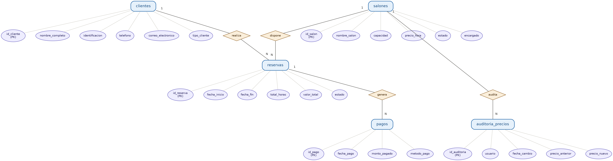

---

## ⚙️ Instrucciones de ejecución

1. Clonar el repositorio:
   ```bash
   git clone https://github.com/<tu-usuario>/eventos_premier_bd.git
   cd eventos_premier_bd
   ```

2. Ejecutar los scripts **en este orden** desde la terminal MySQL:
   ```bash
   mysql -u root -p < sql/01_database.sql
   mysql -u root -p < sql/02_functions.sql
   mysql -u root -p < sql/03_triggers.sql
   mysql -u root -p < sql/04_views_and_queries.sql
   ```

   O bien, dentro del cliente MySQL:
   ```sql
   SOURCE sql/01_database.sql;
   SOURCE sql/02_functions.sql;
   SOURCE sql/03_triggers.sql;
   SOURCE sql/04_views_and_queries.sql;
   ```

3. Verificar que todo se creó correctamente:
   ```sql
   USE eventos_premier;
   SHOW TABLES;
   SHOW FUNCTION STATUS WHERE Db = 'eventos_premier';
   SHOW TRIGGERS;
   ```

---

## 🧮 Funciones

### `calcular_total_reserva(precio_hora, horas)`
Calcula el valor total de una reserva incluyendo el 19% de IVA.

```sql
SELECT calcular_total_reserva(150000, 4);
-- Resultado: 714000.00
```

### `verificar_disponibilidad(id_salon, fecha_inicio, fecha_fin)`
Retorna `1` si el salón está disponible en el rango dado, o `0` si
ya tiene una reserva confirmada que se cruza con ese horario.

```sql
SELECT verificar_disponibilidad(1, '2026-06-01 09:00:00', '2026-06-01 11:00:00');
-- Resultado: 1 (disponible)
```

---

## ⚡ Triggers

| Trigger | Evento | Acción |
|---|---|---|
| `actualizar_estado_salon_trigger` | `AFTER INSERT ON reservas` | Cambia el salón a `Ocupado` |
| `liberar_salon_trigger` | `AFTER DELETE ON reservas` | Vuelve el salón a `Disponible` si no tiene otras reservas activas |
| `auditoria_precios_trigger` | `AFTER UPDATE ON salones` | Registra el cambio de precio en `auditoria_precios` (usuario, fecha, valor anterior/nuevo) |

**Ejemplo:**
```sql
UPDATE salones SET precio_hora = 160000.00 WHERE id_salon = 1;
SELECT * FROM auditoria_precios;
```

---

## 🔎 Consultas y vistas incluidas

- Reservas realizadas en un rango de fechas (`BETWEEN`).
- Salones con capacidad mayor a X personas y `estado = 'Disponible'`.
- Clientes corporativos con más de 3 reservas (subconsulta + `COUNT`).
- Vista `vista_resumen_reservas`: cliente, salón, fecha inicio, fecha
  fin, total y estado de cada reserva.
- Consultas adicionales de apoyo: ingresos por salón y reservas sin
  pago registrado.

```sql
SELECT * FROM vista_resumen_reservas ORDER BY fecha_inicio;
```

---

# 📸 Evidencias

# Capturas de Pantalla


## FUNCIONES

### Calcular fidponibilidad
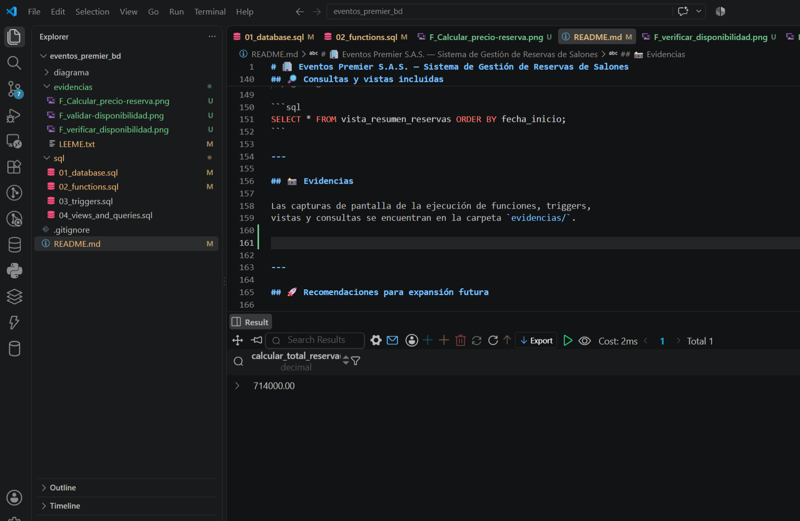

### validar disponibilidad
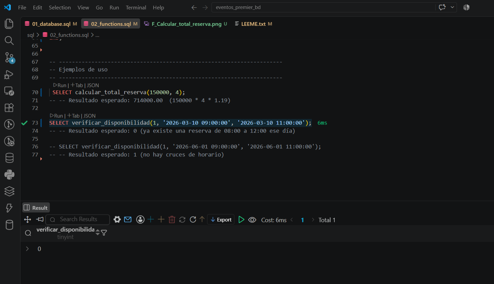

### Verificar Disponibilidad
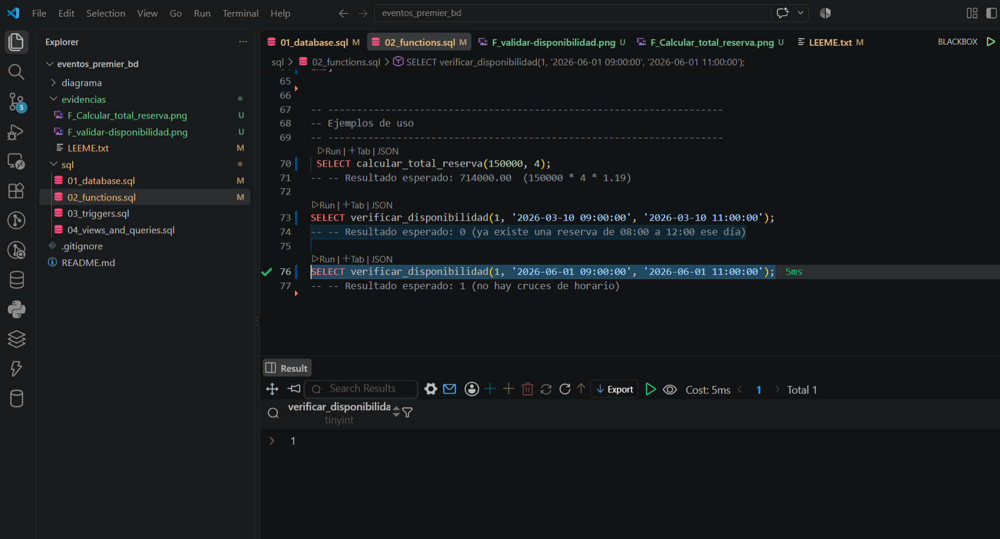


## TRIGGERS

### Actualizar estado
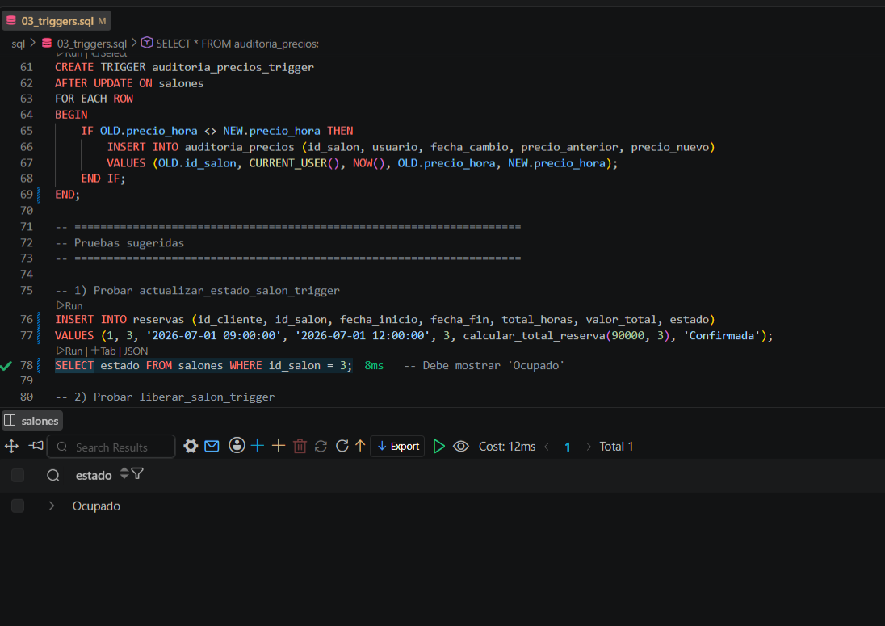

### Liberear esatdo
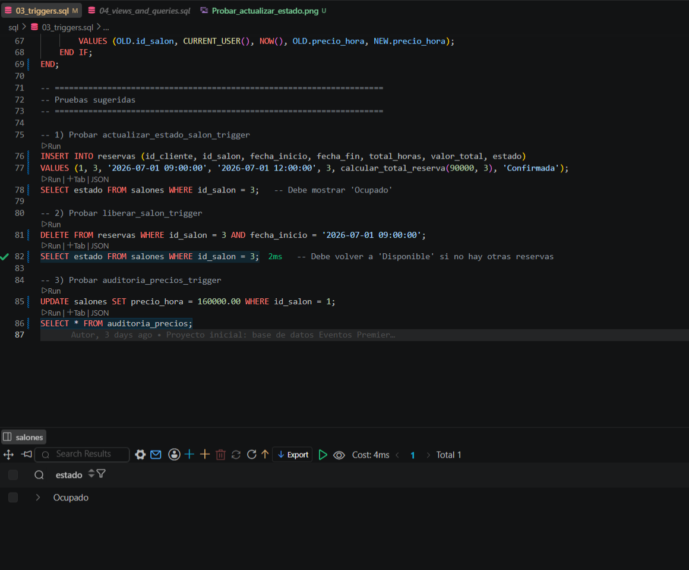

### Aprobar auditoria precios
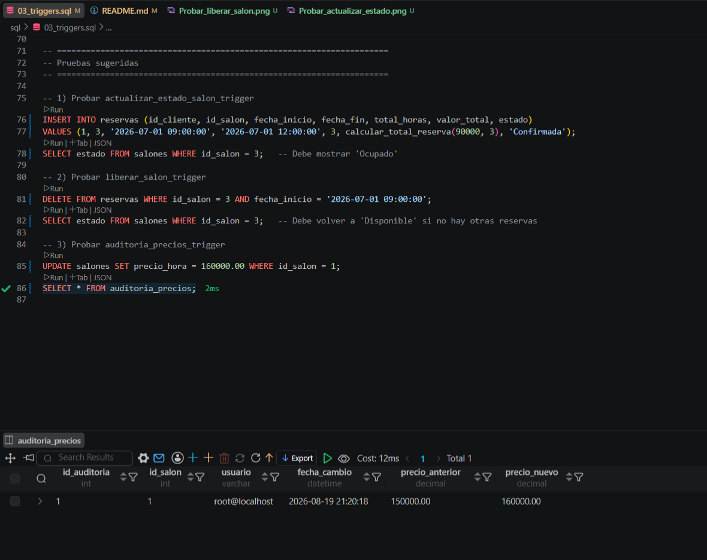


## CONSULTAS

### Consulta_1
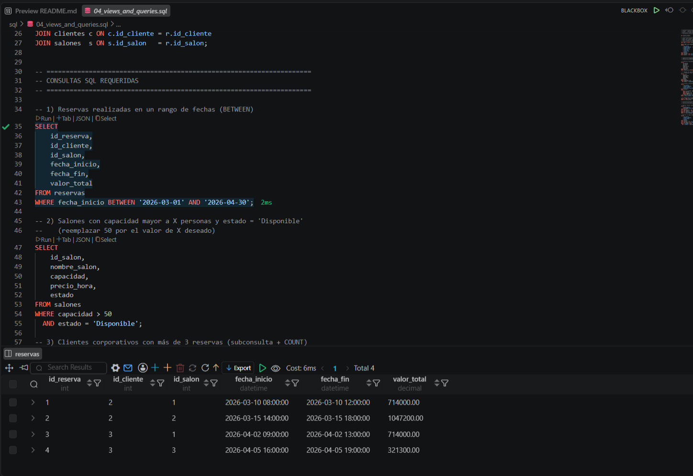

### Consulta_2
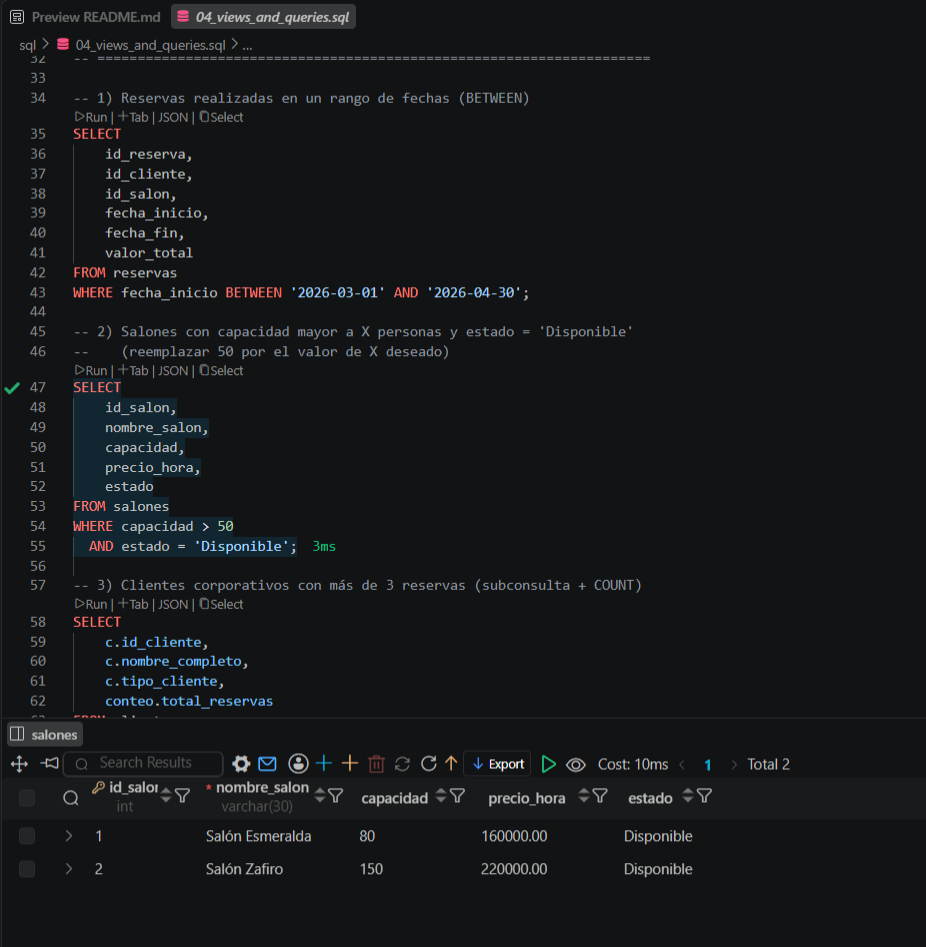

### Consulta_3
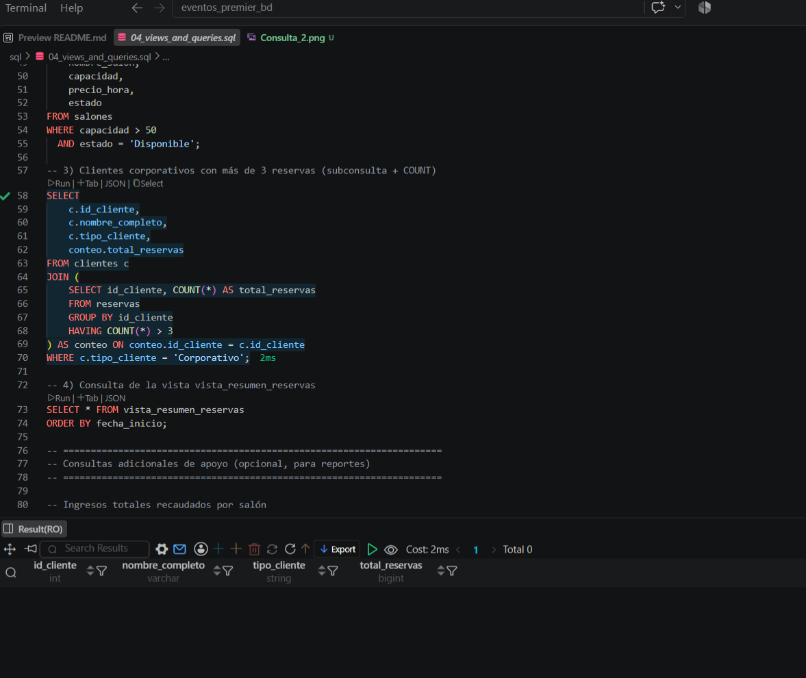

### Consulta_4
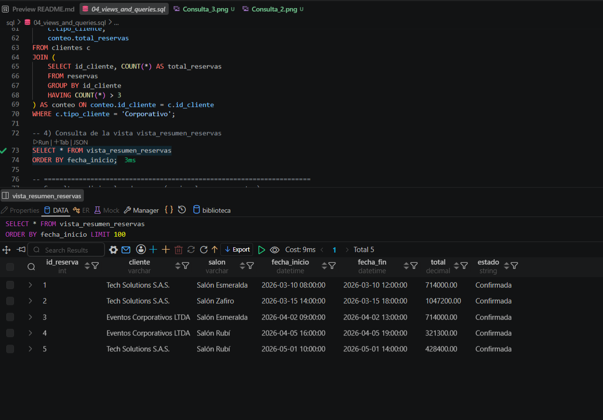

### Consulta_5
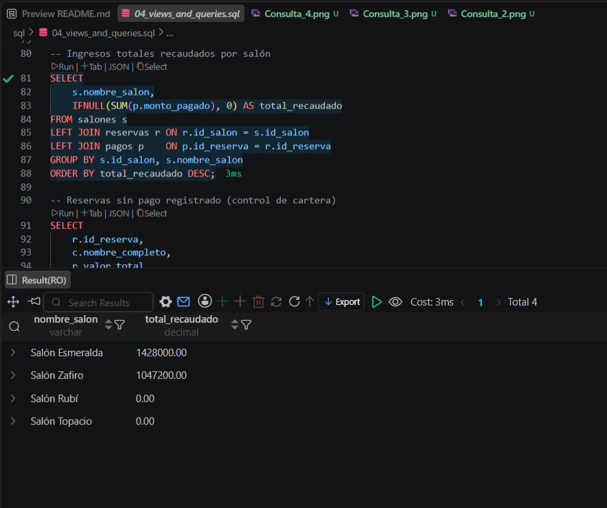

### Consulta_6
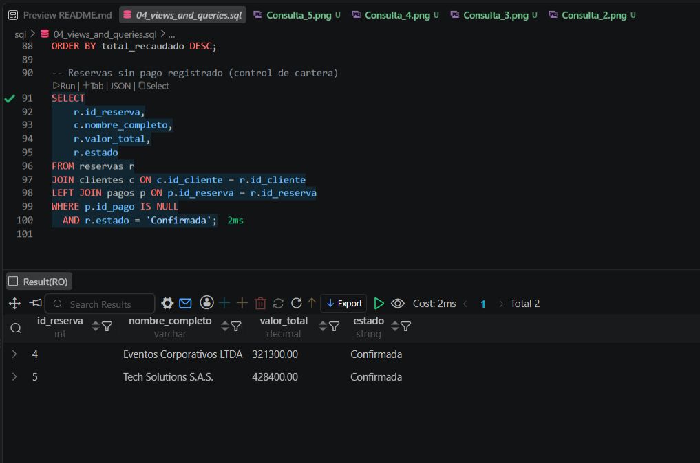


## DIAGARAMA EER

### Diagrama


---

## 🚀 Recomendaciones para expansión futura

- Agregar tabla `usuarios` con roles (administrador, recepcionista)
  para controlar accesos desde la aplicación.
- Registrar histórico de disponibilidad por franja horaria, en lugar
  de un único campo `estado` global por salón.
- Incluir notificaciones automáticas (correo/SMS) al confirmar o
  cancelar una reserva.
- Agregar procedimiento almacenado `sp_crear_reserva` que valide
  disponibilidad, calcule el total e inserte la reserva en una sola
  transacción.
- Implementar reportes mensuales de ocupación y facturación por salón.

---

## 👤 Créditos y autor

**Autor:** Anderson Buitrago Guerrero
**Proyecto académico:** Base de Datos con MySQL(VS CODE) — Sistema de Reservas
**Empresa (caso de estudio):** Eventos Premier S.A.S.
**Fecha:** Agosto de 2026

---

## 📄 Licencia

Este proyecto se distribuye con fines académicos.
